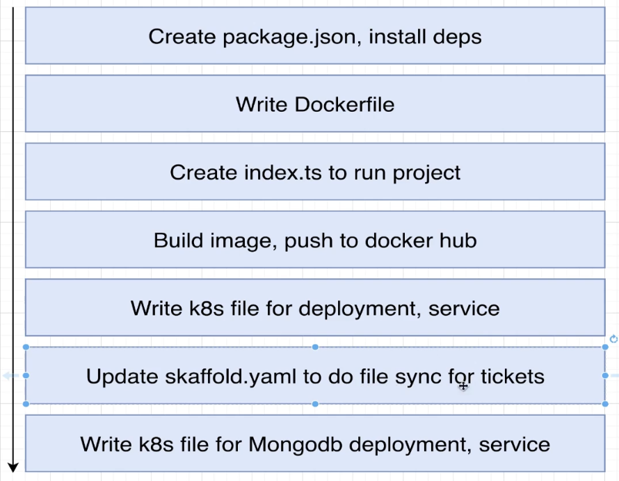

# Starting Instructions

1. Open Terminal
2. Execute `nano /etc/hosts`

   1. add `ticketing.dev` domain like this

      ```
      ##
      # Host Database
      #
      # localhost is used to configure the loopback interface
      # when the system is booting.  Do not change this entry.

      127.0.0.1 ticketing.dev
      ```

3. In Terminal, go to the base directory i.e, **2-ticketing-app**, run `skaffold dev`
4. Wait for everything to build and deploy (This may take a while)
5. Verify the docker images
6. to check the logs

   `kubectl get pods`

   `kubectl logs --follow <pod_name>`

### Points to note

---

Here you have build a npm common module that you need to install in every service
it's `@debirapid-ticket/common`

---

## Steps to add a new service


